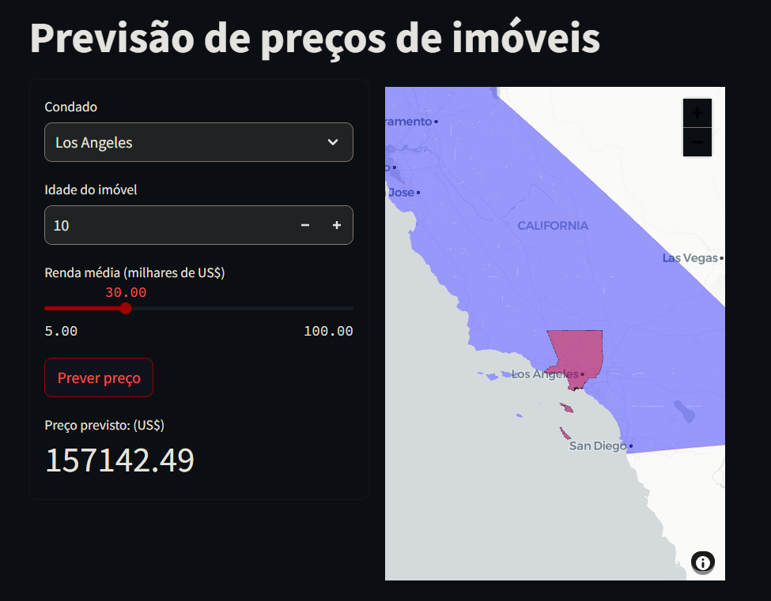

# Projeto de Previsão de Preço de Imóvel na Califórnia (EUA)

Este projeto de ciência de dados tem como objetivo desenvolver um modelo de previsão de preços de imóveis na Califórnia, EUA. Utilizando técnicas de regressão e aprendizado de máquina, o projeto visa fornecer estimativas precisas dos preços dos imóveis com base em diversas características, como distrito, idade do imóvel, renda média do distrito, entre outras, conforme a imagem abaixo.



Link para simulação de preço do imóvel: [Clique aqui](https://lsg-previsao-preco-imovel-california.streamlit.app/)

## Organização do projeto

```
├── .env               <- Arquivo de variáveis de ambiente (não versionar)
├── .gitignore         <- Arquivos e diretórios a serem ignorados pelo Git
├── ambiente.yml       <- O arquivo de requisitos para reproduzir o ambiente de análise
├── LICENSE            <- Licença de código aberto se uma for escolhida
├── README.md          <- README principal para desenvolvedores que usam este projeto.
|
├── dados              <- Arquivos de dados para o projeto.
|
├── modelos            <- Modelos treinados e serializados, previsões de modelos ou resumos de modelos
|
├── notebooks          <- Cadernos Jupyter. A convenção de nomenclatura é um número (para ordenação),
│                         as iniciais do criador e uma descrição curta separada por `-`, por exemplo
│                         `01-lsg-eda`.
│
|   └──src             <- Código-fonte para uso neste projeto.
|      │
|      ├── __init__.py   <- Torna um módulo Python
|      ├── auxiliares.py <- Scripts para função auxiliares no projeto
|      ├── config.py     <- Configurações básicas do projeto
|      ├── graficos.py   <- Scripts para criar visualizações exploratórias e orientadas a resultados
|      └── models.py     <- Scripts para treinar modelos e fazer previsões
|
|   ├── 01-lsg-eda.ipynb                 <- Scripts para análise exploratória dos dados
|   ├── 02-lsg-mapas-sns.ipynb           <- Scripts para analisar mapas com Seaborn
|   ├── 03-lsg-geo.ipynb                 <- Scripts para analisar mapas com GeoPandas e Folium
|   ├── 04-lsg-modelos-cat.ipynb         <- Scripts para treinar modelo de Regressão Linear usando variáveis categóricas
|   ├── 05-lsg-modelos-cat-num.ipynb     <- Scripts para treinar modelo de Regressão Linear usando variáveis categóricas e numéricas
|   ├── 06-lsg-modelos-pol.ipynb         <- Scripts para treinar modelo usando Features Polinomiais
|   ├── 07-lsg-modelos-elasticnet.ipynb  <- Scripts para treinar modelo usando ElasticNet
|   ├── 08-lsg-modelos-ridge.ipynb       <- Scripts para treinar modelo usando Ridge
|
├── referencias        <- Dicionários de dados, manuais e todos os outros materiais explicativos.
|
├── relatorios         <- Análises geradas em HTML, PDF, LaTeX, etc.
│   └── imagens        <- Gráficos e figuras gerados para serem usados em relatórios
```

## Funcionalidades

- **Carregamento de Dados**: Funções para carregar e pré-processar dados de diferentes fontes.
- **Modelagem**: Implementação de modelos de regressão para prever preços de imóveis.
- **Visualização**: Ferramentas para visualização de dados geoespaciais e resultados de previsões.
- **Interface Web**: Aplicação interativa desenvolvida com Streamlit para explorar os dados e previsões.

## Como Usar

1. Clone o repositório:
    ```sh
    git clone <URL-do-repositório>
    ```
2. Crie e ative o ambiente virtual:
    ```sh
    conda env create -f ambiente.yml
    conda activate <nome-do-ambiente>
    ```
3. Execute a aplicação Streamlit:
    ```sh
    streamlit run src/app.py
    ```

## Contribuição

Contribuições são bem-vindas! Sinta-se à vontade para abrir issues e pull requests para melhorias e correções.

## Licença

Este projeto está licenciado sob a Licença MIT.
